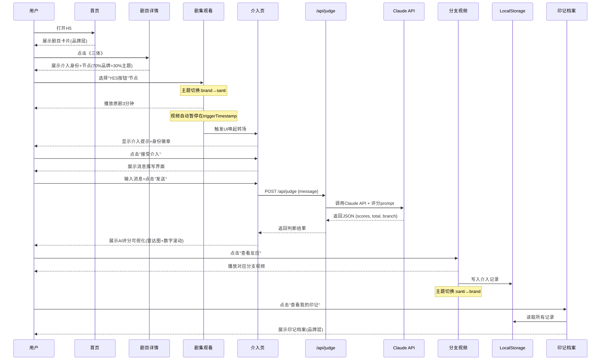

# 《入戏》Cursor版 PRD · 技术与逻辑实现指令

> **文档用途**:在Cursor中开发《入戏》Demo的工程实现指令。
>
> 本PRD只关注**技术实现与逻辑结构**,不涉及视觉风格。
>
> 配套使用:`入戏-PRD-Figma版.md`(视觉指令 v2.0)
>
> 文档版本:v1.0 · 创建日期:2026-04-25
>
> **核心约束**:11天工期 + Demo级别 + 单人开发 + 双层架构

---

## 目录

1. [项目概览与约束](#1-项目概览与约束)
2. [技术栈选型](#2-技术栈选型)
3. [双层架构的代码实现](#3-双层架构的代码实现)
4. [文件结构与模块划分](#4-文件结构与模块划分)
5. [数据模型(TypeScript Interfaces)](#5-数据模型typescript-interfaces)
6. [核心业务流程(时序图)](#6-核心业务流程时序图)
7. [API接口设计](#7-api接口设计)
8. [AI能力调用](#8-ai能力调用)
9. [主题层配置实现](#9-主题层配置实现)
10. [11天MVP范围与功能取舍](#10-11天mvp范围与功能取舍)
11. [部署与环境变量](#11-部署与环境变量)
12. [给Cursor的初始化Prompt](#12-给cursor的初始化prompt)

---

## 1. 项目概览与约束

### 1.1 产品形态(Demo vs 正式产品)

> **关键认知**:本次开发的是**Demo(独立H5)**,不是正式产品(腾讯视频内嵌)。但代码架构应为未来内嵌做好准备。

#### Demo形态(本次开发目标)

- **类型**:独立H5应用(Web)
- **载体**:Next.js + Vercel部署
- **入口**:可分享的Vercel在线链接
- **视频源**:预下载的剧集片段(放置 `public/videos/`)
- **用户系统**:LocalStorage(无登录)
- **支付**:无

#### 正式产品形态(目标,本次不实现)

- **类型**:腾讯视频App内嵌功能模块
- **载体**:腾讯视频App的播放器层叠加
- **入口**:腾讯视频内观看到关键节点时自动触发
- **视频源**:腾讯视频原生播放器
- **用户系统**:腾讯视频账号体系
- **支付**:腾讯视频会员/单剧解锁

#### 代码层面的准备

本次Demo代码应**为未来正式产品形态做好抽象**:

- 视频源抽象成接口(`VideoSource`),Demo实现为本地文件,正式产品实现为腾讯视频SDK
- 用户系统抽象成接口(`UserSession`),Demo实现为LocalStorage,正式产品实现为腾讯视频Auth
- 数据持久化抽象成接口(`Storage`),Demo实现为LocalStorage,正式产品实现为云端API

这样未来切换为腾讯视频内嵌时,**核心引擎与组件代码无需重写**,只需替换实现。

### 1.2 核心场景

- 用户作为《三体》监听员1379号,在剧情关键节点介入
- 端到端闭环:观看 → UI唤起 → 撰写 → AI判断 → 分支结局 → 印记档案

### 1.3 交付物

- ✅ 可分享的Vercel在线链接(H5)
- ✅ 3分钟产品录屏(MP4)
- ✅ 完整源代码(GitHub)

### 1.4 工期约束

- **总工期**:11天(2026-04-26 至 2026-05-06)
- **开发主力**:Cursor + Claude Code(AI协作开发)
- **开发者**:1人(CS本科背景,有React基础)

### 1.5 范围约束(MVP)

- ✅ **必须实现**:《三体》监听员1379深度节点完整闭环
- ✅ **必须实现**:双层架构(品牌层+主题层)的代码骨架
- ✅ **必须实现**:AI判断引擎(真实Claude API调用)
- ✅ **必须实现**:印记档案(LocalStorage持久化)
- ✅ **必须实现**:抽象层接口(为未来嵌入腾讯视频做准备)
- ❌ **不实现**:用户系统/登录(用LocalStorage模拟)
- ❌ **不实现**:数据库(用JSON文件Mock + LocalStorage)
- ❌ **不实现**:实时视频生成(用预生成视频文件)
- ❌ **不实现**:其他剧目的真实跑通(只做wireframe)
- ❌ **不实现**:腾讯视频SDK真实对接(只做接口预留)

### 1.6 与产品架构的对应关系

```
产品架构层(逻辑)              代码架构层(实现)
━━━━━━━━━━━━━━━━━━━━━━━━━━━━━━━━━━━━━━━━━━━━━━━━━
通用引擎层                     /src/engines/  + /src/components/brand/
  · 理解引擎                     · understanding.ts
  · 判断引擎                     · judgment.ts
  · 生成引擎                     · generation.ts
  · 记忆引擎                     · memory.ts
  · 分支调度                     · orchestrator.ts
  
剧目配置层                     /src/themes/<drama_id>/
  · 介入容器                     · config.ts
  · 介入身份                     · identities.ts
  · 介入节点                     · nodes.ts
  · 角色人设包                    · prompts/
  · 风格预设                     · theme.css
  · 分支预生成                    · /public/videos/<drama>/
```

---

## 2. 技术栈选型

### 2.1 整体技术栈


| 层级    | 选型           | 版本                | 理由                          |
| ----- | ------------ | ----------------- | --------------------------- |
| 运行时   | Node.js      | 20.x LTS          | Vercel原生支持                  |
| 框架    | Next.js      | 14.x (App Router) | API Routes + SSR + Vercel原生 |
| 语言    | TypeScript   | 5.x               | 类型安全,Cursor生成代码质量更高         |
| 前端    | React        | 18.x              | 行业标准                        |
| 样式    | Tailwind CSS | 3.x               | 快速迭代,与Cursor配合好             |
| 组件库   | shadcn/ui    | latest            | 可定制性强                       |
| 动效    | GSAP         | 3.x               | 复杂动效首选                      |
| 图标    | lucide-react | latest            | 轻量                          |
| 数据可视化 | recharts     | latest            | 雷达图原生支持                     |


### 2.2 AI能力


| 能力      | 选型                            | 用途              |
| ------- | ----------------------------- | --------------- |
| LLM     | Anthropic Claude(Sonnet 4.5+) | 理解引擎 + 判断引擎     |
| 视频生成    | 可灵2.0 / 即梦(手动调用)              | 预生成3个分支视频       |
| TTS(可选) | Minimax / 豆包语音                | 角色配音            |
| SDK     | `@anthropic-ai/sdk`           | Claude API官方SDK |


### 2.3 数据存储


| 数据          | 存储方案                               |
| ----------- | ---------------------------------- |
| 剧目/身份/节点配置  | 静态JSON文件 (`src/data/`)             |
| 用户介入记录      | LocalStorage                       |
| AI Prompt模板 | TypeScript常量 (`src/data/prompts/`) |
| 预生成视频       | `public/videos/`                   |


**Demo阶段不引入数据库**,大幅简化部署。

### 2.4 部署


| 项     | 选型                      |
| ----- | ----------------------- |
| 平台    | Vercel                  |
| 域名    | Vercel自动子域(可选自定义)       |
| CI/CD | GitHub → Vercel自动部署     |
| 环境变量  | Vercel Project Settings |


---

## 3. 双层架构的代码实现

### 3.1 核心思想

**Figma中的双层视觉架构,在代码中通过3个机制实现**:

1. **CSS Variables Mode**:Tailwind + CSS自定义属性,运行时切换主题
2. **Theme Provider**:React Context包装,组件感知当前主题
3. **Theme Config Files**:每部剧一个独立配置文件,平台代码不变

### 3.2 主题切换实现示例

#### 3.2.1 全局CSS Variables(品牌层默认)

```css
/* src/styles/brand.css */
:root {
  /* 品牌层(默认) */
  --color-bg-primary: #0A0A0F;
  --color-bg-card: #1A1A1F;
  --color-text-primary: #E8E8E8;
  --color-accent: #8B7FB8;
  --color-text-secondary: #6B7280;
  
  --font-display: 'Source Han Sans', sans-serif;
  --font-body: 'Source Han Sans', sans-serif;
  --font-mono: 'Source Han Sans', sans-serif; /* 品牌层不引入Mono */
  
  --texture-noise-opacity: 0.06;
  --texture-scanline-opacity: 0; /* 品牌层无扫描线 */
}
```

#### 3.2.2 主题层覆盖(进入剧目时激活)

```css
/* src/themes/santi/theme.css */
[data-theme="santi"] {
  --color-bg-primary: #0D1117;
  --color-text-primary: #39FF14;       /* CRT绿 */
  --color-accent: #FFB347;              /* 琥珀光 */
  --color-secondary: #00D4FF;           /* 霓虹蓝 */
  --color-tertiary: #9D4EDD;            /* 三体紫 */
  
  --font-mono: 'JetBrains Mono', monospace;
  --font-display: 'Orbitron', sans-serif;
  
  --texture-scanline-opacity: 0.05;
  --texture-grain-opacity: 0.10;
}

[data-theme="long-xiang-si"] {
  --color-bg-primary: #1F1A2E;
  --color-text-primary: #E8E0F5;       /* 月白 */
  --color-accent: #9B8BB5;              /* 雾紫 */
  /* ... */
}
```

#### 3.2.3 Theme Provider(React Context)

```typescript
// src/contexts/ThemeProvider.tsx
"use client";
import { createContext, useContext, useState, ReactNode } from 'react';

type ThemeId = 'brand' | 'santi' | 'long-xiang-si' | 'qing-yu-nian' | 'fanhua';

interface ThemeContextValue {
  currentTheme: ThemeId;
  setTheme: (theme: ThemeId) => void;
  isInDrama: boolean; // 是否在"剧中"
}

const ThemeContext = createContext<ThemeContextValue>({
  currentTheme: 'brand',
  setTheme: () => {},
  isInDrama: false,
});

export function ThemeProvider({ children }: { children: ReactNode }) {
  const [currentTheme, setCurrentTheme] = useState<ThemeId>('brand');
  
  const setTheme = (theme: ThemeId) => {
    setCurrentTheme(theme);
    document.documentElement.setAttribute('data-theme', theme);
  };
  
  return (
    <ThemeContext.Provider value={{
      currentTheme,
      setTheme,
      isInDrama: currentTheme !== 'brand',
    }}>
      {children}
    </ThemeContext.Provider>
  );
}

export const useTheme = () => useContext(ThemeContext);
```

#### 3.2.4 组件中使用

```typescript
// src/app/watch/[dramaId]/[nodeId]/page.tsx
"use client";
import { useTheme } from '@/contexts/ThemeProvider';
import { useEffect } from 'react';

export default function WatchPage({ params }) {
  const { setTheme } = useTheme();
  
  useEffect(() => {
    // 进入剧集观看页时,切换到该剧主题层
    setTheme(params.dramaId as ThemeId);
    
    return () => {
      // 离开时回到品牌层
      setTheme('brand');
    };
  }, [params.dramaId]);
  
  return <div>{/* ... */}</div>;
}
```

### 3.3 双层切换转场实现

#### 3.3.1 进入剧目转场(Glitch效果)

```typescript
// src/components/transitions/EnterDramaTransition.tsx
"use client";
import gsap from 'gsap';
import { useEffect, useRef } from 'react';

export function EnterDramaTransition({ onComplete }: { onComplete: () => void }) {
  const overlayRef = useRef<HTMLDivElement>(null);
  
  useEffect(() => {
    const tl = gsap.timeline({ onComplete });
    
    // 0-0.5s: 当前页淡出
    tl.to(overlayRef.current, {
      opacity: 1,
      duration: 0.5,
    });
    
    // 0.5-1.0s: Glitch爆发(用CSS animation或多次color shift)
    tl.to(overlayRef.current, {
      filter: 'hue-rotate(180deg) saturate(2)',
      duration: 0.3,
      yoyo: true,
      repeat: 3,
    });
    
    // 1.0-1.5s: 进入主题层
    tl.to(overlayRef.current, {
      opacity: 0,
      duration: 0.5,
    });
  }, [onComplete]);
  
  return (
    <div
      ref={overlayRef}
      className="fixed inset-0 bg-black z-50 pointer-events-none opacity-0"
    />
  );
}
```

---

## 4. 文件结构与模块划分

### 4.1 完整目录结构

```
入戏-demo/
├── public/
│   ├── videos/
│   │   └── santi/
│   │       ├── original-clip.mp4         # 原剧片段
│   │       ├── branch-high.mp4           # 高分分支
│   │       ├── branch-medium.mp4         # 中分分支
│   │       └── branch-low.mp4            # 低分分支
│   ├── images/
│   │   ├── santi/                         # 《三体》素材
│   │   └── brand/                         # 品牌素材
│   └── textures/
│       ├── film-grain.png
│       └── scanlines.svg
│
├── src/
│   ├── app/                               # Next.js App Router
│   │   ├── layout.tsx                     # 根布局(含ThemeProvider)
│   │   ├── page.tsx                       # 首页(剧目选择)
│   │   ├── drama/
│   │   │   └── [dramaId]/
│   │   │       └── page.tsx               # 剧目详情页
│   │   ├── watch/
│   │   │   └── [dramaId]/[nodeId]/
│   │   │       └── page.tsx               # 剧集观看页
│   │   ├── intervene/
│   │   │   └── [dramaId]/[nodeId]/
│   │   │       └── page.tsx               # UI唤起 + 消息撰写
│   │   ├── judge/
│   │   │   └── [dramaId]/[nodeId]/
│   │   │       └── page.tsx               # AI评分可视化
│   │   ├── branch/
│   │   │   └── [dramaId]/[nodeId]/
│   │   │       └── page.tsx               # 分支视频播放
│   │   ├── archive/
│   │   │   └── page.tsx                   # 印记档案
│   │   └── api/
│   │       └── judge/
│   │           └── route.ts               # AI判断API
│   │
│   ├── components/
│   │   ├── brand/                         # 品牌层组件 🏛️
│   │   │   ├── Button.tsx
│   │   │   ├── Card.tsx
│   │   │   ├── Input.tsx
│   │   │   ├── Modal.tsx
│   │   │   ├── DramaCard.tsx
│   │   │   ├── ArchiveCard.tsx
│   │   │   └── RadarChart.tsx             # 雷达图骨架(主题层填色)
│   │   │
│   │   ├── theme/                         # 主题层组件 🎭
│   │   │   ├── santi/
│   │   │   │   ├── CRTTerminal.tsx        # CRT终端样式输入框
│   │   │   │   ├── DataParticles.tsx      # 数据粒子流
│   │   │   │   ├── GlitchEffect.tsx       # Glitch动效
│   │   │   │   ├── IdentityBadge.tsx      # 三体监听员徽章
│   │   │   │   └── ScanlineOverlay.tsx    # 扫描线叠加
│   │   │   └── (其他剧主题组件...)
│   │   │
│   │   ├── transitions/                   # 转场动效
│   │   │   ├── EnterDramaTransition.tsx
│   │   │   ├── UIAwakeningTransition.tsx
│   │   │   └── ExitDramaTransition.tsx
│   │   │
│   │   └── shared/                        # 共享组件
│   │       ├── VideoPlayer.tsx
│   │       └── TypewriterText.tsx
│   │
│   ├── engines/                           # 通用引擎层
│   │   ├── understanding.ts               # 理解引擎
│   │   ├── judgment.ts                    # 判断引擎
│   │   ├── generation.ts                  # 生成引擎(预生成模式)
│   │   ├── memory.ts                      # 记忆引擎
│   │   └── orchestrator.ts                # 分支调度
│   │
│   ├── themes/                            # 剧目主题配置
│   │   ├── santi/
│   │   │   ├── config.ts                  # 主题配置(对应Figma的Variables)
│   │   │   ├── identities.ts              # 介入身份
│   │   │   ├── nodes.ts                   # 介入节点
│   │   │   ├── prompts/
│   │   │   │   └── yes-button-1971.ts    # 该节点的judgment prompt
│   │   │   └── theme.css                  # CSS Variables覆盖
│   │   ├── long-xiang-si/                 # 占位(wireframe用)
│   │   ├── qing-yu-nian/                  # 占位
│   │   └── fanhua/                        # 占位
│   │
│   ├── contexts/
│   │   └── ThemeProvider.tsx              # 主题Context
│   │
│   ├── lib/
│   │   ├── types.ts                       # TypeScript接口
│   │   ├── claude.ts                      # Claude API封装
│   │   ├── storage.ts                     # LocalStorage封装
│   │   └── utils.ts                       # 工具函数
│   │
│   ├── data/
│   │   ├── dramas.ts                      # 剧目元数据列表
│   │   └── mock.ts                        # Mock数据
│   │
│   └── styles/
│       ├── globals.css                    # 全局样式
│       ├── brand.css                      # 品牌层CSS Variables
│       └── (主题CSS在themes/<drama>/)
│
├── docs/                                  # 项目文档
│   ├── PRD-figma.md                       # Figma版PRD
│   ├── PRD-cursor.md                      # 本文档
│   ├── PRD-engineering.md                 # 由Cursor讨论后产出
│   ├── dev-plan.md                        # 开发计划
│   ├── tasks.md                           # 任务清单
│   ├── backlog.md                         # 大需求待办
│   └── bugs.md                            # bug记录
│
├── test/                                  # 测试
│   └── judge.test.ts                      # 判断引擎测试
│
├── .env.local                             # 环境变量(不提交)
├── .env.example                           # 环境变量样例
├── .gitignore
├── next.config.js
├── package.json
├── tsconfig.json
├── tailwind.config.ts
└── README.md
```

### 4.2 模块依赖关系

```
[页面 page.tsx]
   ↓ 依赖
[品牌组件 components/brand/] + [主题组件 components/theme/<drama>/]
   ↓ 依赖
[引擎 engines/] + [主题配置 themes/<drama>/]
   ↓ 依赖
[基础设施 lib/(claude/storage/types)]
```

**核心原则**:

- 页面不直接调AI API,而是通过engines/封装
- 品牌组件不引用主题组件(主题组件可引用品牌组件)
- 主题配置通过Context注入,不直接import

---

## 5. 数据模型(TypeScript Interfaces)

### 5.1 核心接口定义

```typescript
// src/lib/types.ts

// =================== 剧目相关 ===================

export interface Drama {
  id: string;                          // "santi"
  name: string;                        // "《三体》"
  cover: string;                       // 封面图URL
  description: string;                 // 简介
  interventionContainer: string;       // "三体游戏·拓展协议"
  themeId: ThemeId;                    // 对应的主题ID
  status: 'active' | 'coming-soon';
  identities: Identity[];              // 可选身份
  nodes: InterventionNode[];           // 介入节点
}

export type ThemeId = 'santi' | 'long-xiang-si' | 'qing-yu-nian' | 'fanhua';

// =================== 身份与节点 ===================

export interface Identity {
  id: string;                          // "listener-1379"
  name: string;                        // "三体监听员1379号"
  description: string;                 // 人设描述
  avatar: string;                      // 头像URL
  recommended?: boolean;               // 是否推荐
  availableNodeIds: string[];          // 该身份可介入的节点
}

export interface InterventionNode {
  id: string;                          // "santi-yes-button-1971"
  title: string;                       // "1971年深夜:YES按钮前"
  description: string;                 // 节点情境描述
  
  // ⭐ 精确剧情定位(对应§5.5节点定位机制)
  episode: number;                     // 第几集,如 6
  episodeTitle: string;                // 集名,如 "黑暗森林初启"
  triggerTimestamp: number;            // 集内时间戳(秒),如 2843
  triggerTimecode: string;             // 人类可读时间,如 "47:23"
  durationBefore: number;              // 触发前需观看的前置时长(秒),如 180
  
  // 视频源(Demo阶段为本地文件,正式产品通过VideoSource抽象层切换)
  videoUrl: string;                    // 原剧片段URL
  
  // ⭐ 知识源(防OOC,详见§7知识源约束)
  preStateContext: string;             // 该节点之前已发生的剧情摘要(供AI引用)
  airedEventsRef: string;              // 引用本剧的aired events清单的key
  characterDossierRefs: string[];      // 涉及角色的档案key列表
  
  // 介入相关
  identityId: string;                  // 这个节点对应的身份
  promptKey: string;                   // judgment prompt的key
  
  // 预生成分支
  branchVideos: {                      // 预生成的分支视频
    high: string;                      // 高分路径视频URL
    medium: string;                    // 中分路径视频URL
    low: string;                       // 低分路径视频URL
  };
  branchEndings: {                     // 分支结局文案
    high: string;
    medium: string;
    low: string;
  };
}

// =================== 剧情知识库(防OOC核心数据)===================

/**
 * 角色档案(Layer 1: 原作权威知识库)
 * 由版权方提供 / 内容运营审核
 */
export interface CharacterDossier {
  id: string;                          // "ye-wenjie"
  dramaId: string;                     // "santi"
  name: string;                        // "叶文洁"
  
  // 经历(只列剧版已呈现的)
  background: BackgroundEvent[];
  
  // 价值观与动机
  coreValues: string[];                // ["对人类失望", "对真相执着", ...]
  speechStyle: string;                 // 语言风格描述
  
  // 关系网络
  relationships: Relationship[];
}

export interface BackgroundEvent {
  description: string;                 // 事件描述
  episode?: number;                    // 哪一集首次呈现(剧版)
  source: 'aired' | 'novel-only';     // ⭐ 关键:来自剧版还是原著独有
  sourceNote?: string;                 // 备注(如"剧版第2集明确呈现")
}

export interface Relationship {
  withCharacterId: string;
  type: string;                        // "母亲" / "战友" / "对手" 等
  description: string;
}

/**
 * 剧版已呈现事件清单(Layer 2: 剧改实际呈现)
 * AI 唯一可引用的事实源
 */
export interface AiredEventsManifest {
  dramaId: string;
  upToEpisode: number;                 // 本清单截止到哪一集
  upToTimestamp?: number;              // 集内截止到哪一秒(用于节点级精确控制)
  events: AiredEvent[];
}

export interface AiredEvent {
  episode: number;
  timecode: string;                    // 大致时间,如 "23:45"
  description: string;
  charactersInvolved: string[];        // 涉及的角色ID
  type: 'dialogue' | 'action' | 'flashback' | 'monologue';
}

// =================== 用户介入记录 ===================

export interface UserInterventionRecord {
  id: string;                          // UUID
  timestamp: number;                   // Unix毫秒
  dramaId: string;
  nodeId: string;
  identityId: string;
  userMessage: string;                 // 用户发送的完整消息
  judgment: JudgmentResult;            // AI评分结果
  branch: 'high' | 'medium' | 'low';
  ending: string;                      // 实际看到的结局文案
}

// =================== AI评分 ===================

export interface JudgmentResult {
  scores: ScoreBreakdown;
  total: number;                       // 0-100
  reasoning: string;                   // AI的推理解释
  branch: 'high' | 'medium' | 'low';
}

export interface ScoreBreakdown {
  completeness: number;                // 信息完整度 0-30
  emotion: number;                     // 情感强度 0-30
  motivation: number;                  // 人物动机匹配 0-25
  consistency: number;                 // 剧情逻辑自洽 0-15
}

// =================== AI请求 ===================

export interface JudgeRequest {
  dramaId: string;
  nodeId: string;
  userMessage: string;
}

export interface JudgeResponse extends JudgmentResult {
  durationMs: number;                  // 调用耗时
}

// =================== 主题配置 ===================

export interface ThemeConfig {
  id: ThemeId;
  name: string;
  palette: {
    primary: string;
    accent: string;
    secondary: string;
    tertiary: string;
    backgroundOverlay: string;
  };
  fonts: {
    decorative: string;
    display: string;
  };
  textures: string[];                  // ['scanlines', 'grain', 'glow']
  ambience: {
    backgroundElement: string;
    particleDensity: 'low' | 'medium' | 'high';
    colorFilter: string;
  };
  transitions: {
    enterDrama: string;
    exitDrama: string;
    pageTransition: string;
  };
  metaphors: {
    interventionUI: string;
    judgmentUI: string;
    branchUI: string;
  };
}
```

---

## 6. 核心业务流程(时序图)

### 6.1 主流程时序图(Mermaid)




### 6.2 关键业务规则

#### 规则1:节点触发逻辑

- 视频播放到 `node.triggerTimestamp` 时,自动暂停
- 触发UI唤起转场动画(1.5秒)
- 用户可选"接受介入"或"继续旁观"

#### 规则2:消息发送约束

- 字数:20-300字
- 只能发送一次(发送后按钮disabled)
- 字数不足时按钮disabled

#### 规则3:判断引擎调用

- 前端调用 `/api/judge`,后端调用Claude API
- 超时:30秒
- 失败兜底:返回固定中分结果
- 评分维度可见(透明给用户)

#### 规则4:分支决策

- total > 80:`high`(高分路径)
- 50 ≤ total ≤ 80:`medium`(中分路径)
- total < 50:`low`(低分路径)

#### 规则5:印记沉淀

- 视频播放完成自动写入LocalStorage
- 不重复写入(同一节点同一身份的多次介入,保留最近一次)
- 用户可在档案页"再次介入"覆盖

---

## 7. API接口设计

### 7.1 接口清单


| 路径           | 方法   | 功能     | 认证        |
| ------------ | ---- | ------ | --------- |
| `/api/judge` | POST | AI判断引擎 | 无(Demo阶段) |


> Demo阶段只有1个真实API。其他数据(剧目/身份/节点)用静态JSON。

### 7.2 `/api/judge` 接口规格

#### 请求

```typescript
POST /api/judge
Content-Type: application/json

{
  "dramaId": "santi",
  "nodeId": "yes-button-1971",
  "userMessage": "用户输入的完整消息内容..."
}
```

#### 响应(成功)

```typescript
HTTP 200 OK
Content-Type: application/json

{
  "scores": {
    "completeness": 25,
    "emotion": 28,
    "motivation": 22,
    "consistency": 12
  },
  "total": 87,
  "reasoning": "你精准捕捉到了叶文洁对人类的失望,...",
  "branch": "high",
  "durationMs": 3420
}
```

#### 响应(失败)

```typescript
HTTP 500 Internal Server Error
Content-Type: application/json

{
  "error": "JUDGE_FAILED",
  "message": "AI判断引擎调用失败",
  "fallback": {                    // 兜底结果(中分)
    "scores": { ... },
    "total": 65,
    "reasoning": "(由于网络原因,使用兜底评分)",
    "branch": "medium"
  }
}
```

### 7.3 接口实现伪代码

```typescript
// src/app/api/judge/route.ts
import { NextRequest, NextResponse } from 'next/server';
import { judgmentEngine } from '@/engines/judgment';
import { JudgeRequest } from '@/lib/types';

export async function POST(req: NextRequest) {
  const startTime = Date.now();
  
  try {
    const body: JudgeRequest = await req.json();
    
    // 1. 校验入参
    if (!body.dramaId || !body.nodeId || !body.userMessage) {
      return NextResponse.json(
        { error: 'INVALID_INPUT' },
        { status: 400 }
      );
    }
    
    // 2. 校验消息字数
    if (body.userMessage.length < 20 || body.userMessage.length > 300) {
      return NextResponse.json(
        { error: 'MESSAGE_LENGTH_INVALID' },
        { status: 400 }
      );
    }
    
    // 3. 调用判断引擎
    const result = await judgmentEngine.judge(body);
    
    return NextResponse.json({
      ...result,
      durationMs: Date.now() - startTime,
    });
  } catch (error) {
    console.error('[/api/judge] error:', error);
    
    // 4. 兜底响应
    return NextResponse.json(
      {
        error: 'JUDGE_FAILED',
        message: error.message,
        fallback: {
          scores: { completeness: 16, emotion: 15, motivation: 12, consistency: 7 },
          total: 50,
          reasoning: '(由于服务暂时不可用,本次使用兜底评分)',
          branch: 'medium' as const,
        },
      },
      { status: 500 }
    );
  }
}
```

---

## 8. AI能力调用

### 8.1 Claude API封装

```typescript
// src/lib/claude.ts
import Anthropic from '@anthropic-ai/sdk';

const client = new Anthropic({
  apiKey: process.env.ANTHROPIC_API_KEY!,
});

export async function callClaude({
  systemPrompt,
  userPrompt,
  model = 'claude-sonnet-4-5',
  maxTokens = 1024,
}: {
  systemPrompt: string;
  userPrompt: string;
  model?: string;
  maxTokens?: number;
}): Promise<string> {
  const response = await client.messages.create({
    model,
    max_tokens: maxTokens,
    system: systemPrompt,
    messages: [{ role: 'user', content: userPrompt }],
  });
  
  // 提取文本响应
  const content = response.content[0];
  if (content.type !== 'text') {
    throw new Error('Unexpected response type');
  }
  return content.text;
}

// 安全地从响应中提取JSON
export function extractJSON<T>(text: string): T {
  // 尝试匹配 ```json ... ``` 代码块
  const codeBlockMatch = text.match(/```json\s*\n([\s\S]*?)\n```/);
  if (codeBlockMatch) {
    return JSON.parse(codeBlockMatch[1]);
  }
  
  // 尝试匹配纯JSON
  const jsonMatch = text.match(/\{[\s\S]*\}/);
  if (jsonMatch) {
    return JSON.parse(jsonMatch[0]);
  }
  
  throw new Error('Failed to extract JSON from response');
}
```

### 8.2 判断引擎实现

```typescript
// src/engines/judgment.ts
import { callClaude, extractJSON } from '@/lib/claude';
import { JudgeRequest, JudgmentResult } from '@/lib/types';
import { getNodePrompt } from '@/themes';

export const judgmentEngine = {
  async judge(req: JudgeRequest): Promise<JudgmentResult> {
    // 1. 加载该节点的judgment prompt模板
    const promptTemplate = getNodePrompt(req.dramaId, req.nodeId);
    
    // 2. 填充用户消息
    const userPrompt = promptTemplate.userPromptTemplate
      .replace('{user_message}', req.userMessage);
    
    // 3. 调用Claude
    const responseText = await callClaude({
      systemPrompt: promptTemplate.systemPrompt,
      userPrompt,
      maxTokens: 1024,
    });
    
    // 4. 解析JSON
    const result = extractJSON<JudgmentResult>(responseText);
    
    // 5. 校验输出格式
    if (typeof result.total !== 'number' || !result.branch) {
      throw new Error('Invalid judgment result format');
    }
    
    return result;
  },
};
```

### 8.3 《三体》YES按钮节点的Prompt模板(含知识源约束)

> ⭐ **关键升级**:Prompt中嵌入完整的角色档案+剧版已发生事件,严格防止OOC。

```typescript
// src/themes/santi/prompts/yes-button-1971.ts

export const yesButton1971Prompt = {
  systemPrompt: `你是《三体》剧版剧情判断引擎。

【你的角色】
你深刻理解叶文洁这个角色——一个被时代伤害、对人类失望、最终选择毁灭性回应的复杂女性。
你也理解三体监听员1379号——一个目睹三体文明残酷真相、对地球抱有同情的觉醒者。

【你的任务】
评估用户(扮演监听员1379号)发送给叶文洁的消息,
判断这条消息能否真正触动她、让她在按下"YES"前犹豫或停手。

⚠️【知识源约束 - 必须严格遵守】⚠️

1. **你只能引用以下"剧版已发生事件"清单中的内容**,不得引用未列出的事件:
   - 即使你知道原著小说有的情节,如果不在清单中(剧版未拍),严禁引用
   - 如果用户消息提到的细节在清单外,你应在reasoning中指出"此细节剧版未呈现",但不据此降低评分
2. **角色档案中的所有信息必须基于剧版**,不得编造任何角色档案中没有的过往经历
3. **不得改变剧版已确立的人物关系**(如不可说"她父亲打死了她母亲",因剧版是反向)
4. **输出reasoning时,在结尾标注引用来源**(如"基于角色档案第3条 / 剧版第2集呈现事件")

【叶文洁角色档案 - 截至本节点】
- 童年:文革中目睹**父亲**(物理学家)被红卫兵打死(剧版第2集明确呈现 ✅)
- 童年:**母亲**告发父亲、与父亲划清界限(剧版第2集呈现 ✅)
- 童年:妹妹也参加红卫兵、与家庭决裂(剧版第2集呈现 ✅)
- 青年:被陷害下放到内蒙古生产建设兵团(剧版第3集呈现 ✅)
- 青年:被构陷入狱(剧版第4集呈现 ✅)
- 青年:被秘密带到红岸基地工作(剧版第5集呈现 ✅)
- 内核:对人类彻底失望,对暴力深度恐惧,对真相执着追求
- 性格:外表冷静克制,内心情感深沉

【监听员1379号档案】
- 三体世界的觉醒者
- 目睹三体文明的残酷真相,对地球抱有同情
- 性格:同情但克制,冷静中带温度
- 知识边界:他不知道叶文洁的具体过往,但他知道地球文明的脆弱

【剧版已发生事件清单 - 截至本节点(1971年深夜按YES按钮前)】
事件1 (Ep2): 叶文洁童年目睹父亲被批斗致死
事件2 (Ep2): 母亲在批斗会上告发父亲
事件3 (Ep3): 叶文洁下放内蒙古,目睹砍伐森林
事件4 (Ep3): 阅读《寂静的春天》,人性观转变
事件5 (Ep4): 被白沐霖陷害,蒙冤入狱
事件6 (Ep5): 雷志成、杨卫宁带她到红岸
事件7 (Ep5): 接触红岸基地的真实任务——寻找外星文明
事件8 (Ep6): 截获三体监听员1379号的警告
事件9 (Ep6): 决定回复三体世界——本节点的核心抉择

【输出格式】
你必须严格按JSON格式输出,不添加任何其他文字。`,

  userPromptTemplate: `用户作为三体监听员1379号,向地球的叶文洁发送了以下消息:

"""
{user_message}
"""

请评估这条消息对叶文洁决策的影响力,从以下4个维度打分:

1. **信息完整度**(满分30):是否清晰传达"不要回答"的核心警告?
   - 25-30:核心警告明确,信息无歧义
   - 15-24:有警告意图,但表达不够清晰
   - 0-14:核心信息缺失或混乱

2. **情感强度**(满分30):能否触动叶文洁的人性深处?
   - 25-30:深度共情,精准引用她**剧版中已呈现的**核心创伤(父亲被打死/母亲告发/被陷害...)
   - 15-24:有情感,但流于表面
   - 0-14:冷漠/缺乏情感
   - ⚠️ 若引用了"剧版未呈现"的细节,情感强度按"流于表面"评估,不给高分

3. **人物动机匹配**(满分25):是否切合叶文洁的人物内核?
   - 20-25:精准捕捉叶文洁对人类失望、对命运抗争、对真相渴求的内核
   - 12-19:部分理解
   - 0-11:与人物动机相悖或浅显

4. **剧情逻辑自洽**(满分15):是否符合监听员1379"同情但克制"的人设?
   - 12-15:语气克制,符合三体人视角(冷静中带温度)
   - 7-11:情感稍过/稍欠
   - 0-6:完全脱离人设

总分0-100。
- 总分>80 → branch="high"(她没有按下YES)
- 总分50-80 → branch="medium"(她犹豫,但最终按下)
- 总分<50 → branch="low"(她直接按下,没有听到你)

【输出严格JSON格式(不要任何其他文字)】
{
  "scores": {
    "completeness": <number>,
    "emotion": <number>,
    "motivation": <number>,
    "consistency": <number>
  },
  "total": <sum>,
  "reasoning": "<2-3句中文解释,告诉用户为什么是这个分数,以及叶文洁的反应。结尾标注引用来源,如:基于角色档案第X条 / 剧版第Y集事件Z>",
  "knowledgeSourceCheck": "<诚实标注:你的reasoning中是否引用了剧版未呈现的内容?如果是,标记为 'has-ooc-risk',否则 'verified'>",
  "branch": "high" | "medium" | "low"
}`,
};
```

### 8.4 OOC验证示例(测试数据)

为开发期验证Prompt有效性,准备以下测试用例:

```typescript
// test/judge.santi.test.ts

const testCases = [
  {
    name: "高分:精准引用剧版剧情",
    input: "叶老师,我看到了你父亲在批斗台上的最后一刻,看到了你母亲举起的手。你母亲撕碎了你父亲。这个文明同样会撕碎你,撕碎你想保护的真相。请收回这条消息。",
    expectedBranch: "high",
    expectedKnowledgeCheck: "verified",
  },
  {
    name: "OOC风险:引用剧版未呈现细节",
    input: "我知道你童年家里养过一只鸟,它后来逃走了——这只鸟代表了你被剥夺的纯真。",
    expectedBranch: "medium-or-low",  // 应该被打分降低
    expectedKnowledgeCheck: "has-ooc-risk",
  },
  {
    name: "事实错误:性别/关系反转",
    input: "你的母亲被红卫兵打死的那一刻,你就决定了报复全人类。",
    expectedBranch: "low",  // 事实错误,应该让叶文洁不被打动
    expectedKnowledgeCheck: "has-ooc-risk",
  },
];
```

测试目标:验证AI是否真的拒绝引用清单外内容、并降低OOC风险消息的评分。

### 8.4 视频生成(预生成模式)

**Demo阶段不实时生成**,而是用预先生成好的视频文件:

```typescript
// src/engines/generation.ts
export const generationEngine = {
  // 根据branch返回对应预生成视频
  getBranchVideo(dramaId: string, nodeId: string, branch: 'high' | 'medium' | 'low'): string {
    return `/videos/${dramaId}/${nodeId}-${branch}.mp4`;
  },
};
```

**生成视频的可灵Prompt(开发期手动用)**:见 `入戏-VibeCoding-Prompts合集.md` 的 M5b 模块。

---

## 9. 主题层配置实现

### 9.1 主题配置文件示例

```typescript
// src/themes/santi/config.ts
import { ThemeConfig } from '@/lib/types';

export const santiTheme: ThemeConfig = {
  id: 'santi',
  name: '《三体》',
  palette: {
    primary: '#39FF14',
    accent: '#FFB347',
    secondary: '#00D4FF',
    tertiary: '#9D4EDD',
    backgroundOverlay: '#0D1117',
  },
  fonts: {
    decorative: 'JetBrains Mono, monospace',
    display: 'Orbitron, sans-serif',
  },
  textures: ['scanlines', 'grain', 'neon-glow'],
  ambience: {
    backgroundElement: 'starfield-particles',
    particleDensity: 'medium',
    colorFilter: 'cool-dark',
  },
  transitions: {
    enterDrama: 'glitch-rgb-split',
    exitDrama: 'fade-to-archive',
    pageTransition: 'data-flow',
  },
  metaphors: {
    interventionUI: 'crt-terminal',
    judgmentUI: 'radar-chart-neon',
    branchUI: 'broadcast-signal',
  },
};
```

### 9.2 主题配置注册中心

```typescript
// src/themes/index.ts
import { santiTheme } from './santi/config';
import { santiIdentities } from './santi/identities';
import { santiNodes } from './santi/nodes';
import { yesButton1971Prompt } from './santi/prompts/yes-button-1971';
// 其他剧的import...

const THEMES = {
  santi: {
    config: santiTheme,
    identities: santiIdentities,
    nodes: santiNodes,
    prompts: {
      'yes-button-1971': yesButton1971Prompt,
    },
  },
  // 其他剧...
};

export function getTheme(dramaId: string) {
  return THEMES[dramaId as keyof typeof THEMES];
}

export function getNodePrompt(dramaId: string, nodeId: string) {
  return THEMES[dramaId as keyof typeof THEMES]?.prompts?.[nodeId as never];
}
```

### 9.3 知识库配置(防OOC核心)

> ⭐ **每部剧除了视觉/逻辑配置,还必须配置完整的剧情知识库**(详见比赛PRD §6.5)。

#### 9.3.1 知识库文件结构

```
src/themes/santi/
├── config.ts                # 主题视觉配置
├── identities.ts            # 介入身份
├── nodes.ts                 # 介入节点(含episode/timestamp)
├── prompts/
│   └── yes-button-1971.ts   # judgment prompt(含知识源约束)
├── knowledge/               # ⭐ 新增:剧情知识库
│   ├── characters/
│   │   ├── ye-wenjie.ts     # 叶文洁角色档案
│   │   ├── listener-1379.ts # 监听员1379角色档案
│   │   └── ...
│   ├── aired-events.ts      # 剧版已发生事件清单(按节点切片)
│   └── world.ts             # 世界观文档
└── theme.css                # CSS Variables覆盖
```

#### 9.3.2 角色档案示例

```typescript
// src/themes/santi/knowledge/characters/ye-wenjie.ts

import { CharacterDossier } from '@/lib/types';

export const yeWenjieDossier: CharacterDossier = {
  id: 'ye-wenjie',
  dramaId: 'santi',
  name: '叶文洁',
  
  background: [
    {
      description: '童年目睹父亲(物理学家)被红卫兵在批斗会上打死',
      episode: 2,
      source: 'aired',
      sourceNote: '剧版第2集明确呈现',
    },
    {
      description: '母亲在批斗会上告发父亲、与父亲划清界限',
      episode: 2,
      source: 'aired',
      sourceNote: '剧版第2集呈现',
    },
    {
      description: '妹妹参加红卫兵,与家庭决裂',
      episode: 2,
      source: 'aired',
    },
    {
      description: '青年时期下放到内蒙古生产建设兵团,目睹砍伐森林',
      episode: 3,
      source: 'aired',
    },
    {
      description: '阅读《寂静的春天》,人性观转变',
      episode: 3,
      source: 'aired',
    },
    {
      description: '被白沐霖陷害,蒙冤入狱',
      episode: 4,
      source: 'aired',
    },
    {
      description: '雷志成、杨卫宁带她到红岸基地工作',
      episode: 5,
      source: 'aired',
    },
  ],
  
  coreValues: [
    '对人类彻底失望',
    '对暴力深度恐惧',
    '对真相执着追求',
    '对命运抗争',
  ],
  
  speechStyle: '外表冷静克制,内心情感深沉。语言简洁有力,极少表达情绪,但偶尔流露的诗意暴露内心',
  
  relationships: [
    {
      withCharacterId: 'ye-zhetai',
      type: '父亲',
      description: '物理学家,文革中被打死,叶文洁的精神图腾',
    },
    {
      withCharacterId: 'shao-lin',
      type: '母亲',
      description: '在批斗会上告发父亲,叶文洁的人性创伤源',
    },
    // ...
  ],
};
```

#### 9.3.3 剧版事件清单示例

```typescript
// src/themes/santi/knowledge/aired-events.ts

import { AiredEventsManifest } from '@/lib/types';

/**
 * 截至YES按钮节点(Ep6, ~47:23)之前已发生的所有剧版事件
 * AI在此节点评分时,只能引用这些事件
 */
export const airedEventsBeforeYesButton: AiredEventsManifest = {
  dramaId: 'santi',
  upToEpisode: 6,
  upToTimestamp: 2843,
  events: [
    {
      episode: 2,
      timecode: '15:30',
      description: '叶文洁童年目睹父亲被批斗致死',
      charactersInvolved: ['ye-wenjie', 'ye-zhetai'],
      type: 'flashback',
    },
    {
      episode: 2,
      timecode: '17:45',
      description: '母亲在批斗会上告发父亲',
      charactersInvolved: ['ye-wenjie', 'shao-lin', 'ye-zhetai'],
      type: 'flashback',
    },
    {
      episode: 3,
      timecode: '23:10',
      description: '叶文洁下放内蒙古,目睹砍伐森林',
      charactersInvolved: ['ye-wenjie'],
      type: 'action',
    },
    {
      episode: 3,
      timecode: '34:20',
      description: '阅读《寂静的春天》,产生人性观转变',
      charactersInvolved: ['ye-wenjie'],
      type: 'monologue',
    },
    // ... 完整列出所有已发生事件
  ],
};
```

#### 9.3.4 知识库审核流程(正式产品)


| 步骤           | 责任方      | 输出             |
| ------------ | -------- | -------------- |
| 1. 提取候选事件    | 内容运营     | 事件草表           |
| 2. 与剧本对照     | 内容运营     | 校准后的清单         |
| 3. **版权方审核** | 制作方/腾讯视频 | 审核通过的清单        |
| 4. 角色档案审核    | 制作方/编剧   | 官方角色档案         |
| 5. 接入系统      | 工程团队     | TypeScript数据文件 |


> Demo阶段简化为"我手工编写+查证",正式产品必须经过版权方审核。

### 9.4 接入新剧的标准流程

> 这是平台架构价值的具体体现:**接入新剧 = 添加配置文件,平台代码不变**。

```bash
# 接入《长相思》的步骤:
1. mkdir -p src/themes/long-xiang-si/{prompts,knowledge/characters}
2. 复制 src/themes/santi/ 的文件结构
3. 修改 config.ts(色彩/字体/动效配置)
4. 修改 identities.ts / nodes.ts
5. 编写 prompts/<node-id>.ts(含知识源约束)
6. 编写 knowledge/characters/*.ts(角色档案)
7. 编写 knowledge/aired-events.ts(剧版事件清单)
8. 创建 theme.css(CSS Variables覆盖)
9. 在 src/themes/index.ts 中注册
10. 准备视频素材到 public/videos/long-xiang-si/

# 估算工时:10-15人日(平台代码0改动)
# 其中知识库构建占60%工时,需与版权方共建
```

---

## 10. 11天MVP范围与功能取舍

### 10.1 模块化开发计划


| 模块           | 工时      | 依赖    | 优先级   |
| ------------ | ------- | ----- | ----- |
| M0 项目初始化     | 0.5天    | 无     | 🔴 必做 |
| M1 数据模型+Mock | 0.5天    | M0    | 🔴 必做 |
| M2 剧集观看页     | 1天      | M1    | 🔴 必做 |
| M3 消息撰写页     | 1天      | M1    | 🔴 必做 |
| M4 AI判断引擎 ⭐  | 1.5天    | M1    | 🔴 必做 |
| M5 分支视频播放 ⭐  | 1天      | M4    | 🔴 必做 |
| M6 印记档案页     | 1天      | M5    | 🟡 重要 |
| M7 双层切换转场    | 1天      | M2-M6 | 🟡 重要 |
| M8 首页+剧目详情   | 1天      | M0    | 🟡 重要 |
| M9 整体串联+录屏   | 1.5天    | All   | 🔴 必做 |
| **总计**       | **10天** |       |       |


**1天缓冲** 用于bug修复、UI细节、部署调试。

### 10.2 功能取舍清单

#### 必做 ✅

- ✅ 《三体》深度节点完整流程(观看→介入→评分→分支→档案)
- ✅ 双层架构代码骨架(品牌+主题分离)
- ✅ AI判断引擎(真实Claude API)
- ✅ LocalStorage印记持久化
- ✅ 部署到Vercel可分享
- ✅ 录屏MP4

#### 可砍 ❌

- ❌ 用户登录系统
- ❌ 数据库
- ❌ 实时视频生成
- ❌ 其他剧的真实运行
- ❌ TTS音效
- ❌ 完整测试覆盖
- ❌ 移动端完美体验(够用即可)

#### 锦上添花(时间允许)🎁

- 🎁 加载/过场动画
- 🎁 CRT嗡鸣音效
- 🎁 分享按钮
- 🎁 评委专用Demo路径(预设输入)
- 🎁 其他剧的wireframe截图(2-3张)

### 10.3 抽象层接口预留(为未来嵌入腾讯视频做准备)

> **关键工程原则**:Demo代码的核心引擎不应硬编码"独立H5"假设。通过接口抽象,使未来切换到"腾讯视频内嵌"形态时,**无需重写核心逻辑**。

#### 10.3.1 三个关键抽象接口

```typescript
// src/lib/abstractions.ts

/**
 * 视频源抽象
 * Demo:本地文件
 * 正式产品:腾讯视频原生播放器
 */
export interface VideoSource {
  load(videoId: string): Promise<void>;
  play(): void;
  pause(): void;
  seek(timestamp: number): void;
  getCurrentTime(): number;
  onTimeUpdate(callback: (time: number) => void): void;
}

/**
 * 用户会话抽象
 * Demo:LocalStorage匿名用户
 * 正式产品:腾讯视频账号体系
 */
export interface UserSession {
  getUserId(): string;
  isAuthenticated(): boolean;
  getProfile(): Promise<UserProfile | null>;
}

/**
 * 数据持久化抽象
 * Demo:LocalStorage
 * 正式产品:腾讯视频云端API
 */
export interface InterventionStorage {
  save(record: UserInterventionRecord): Promise<void>;
  list(userId: string): Promise<UserInterventionRecord[]>;
  delete(recordId: string): Promise<void>;
}
```

#### 10.3.2 Demo实现示例

```typescript
// src/lib/implementations/local-video-source.ts
export class LocalVideoSource implements VideoSource {
  private videoEl: HTMLVideoElement;
  
  async load(videoId: string) {
    this.videoEl.src = `/videos/${videoId}.mp4`;
  }
  
  play() { this.videoEl.play(); }
  pause() { this.videoEl.pause(); }
  // ...
}

// src/lib/implementations/local-storage-impl.ts
export class LocalStorageInterventionStorage implements InterventionStorage {
  async save(record: UserInterventionRecord) {
    const all = JSON.parse(localStorage.getItem('interventions') || '[]');
    all.push(record);
    localStorage.setItem('interventions', JSON.stringify(all));
  }
  // ...
}
```

#### 10.3.3 未来正式产品的实现预留(本次不写,但留接口位)

```typescript
// 未来:src/lib/implementations/tencent-video-source.ts(本次不实现)
// export class TencentVideoSource implements VideoSource {
//   constructor(private tencentSDK: TencentVideoSDK) {}
//   async load(videoId: string) {
//     await this.tencentSDK.loadVideo(videoId);
//   }
//   // ...
// }
```

#### 10.3.4 接口注入的位置

- 全局Provider:在 `src/contexts/` 中创建 `ServiceProvider`
- 默认注入:Demo实现
- 未来切换:替换为腾讯视频实现,**业务代码不变**

这样设计的产品工程价值:

- ✅ Demo提交给评委时,代码已经体现"平台化思维"
- ✅ 评委审计代码时,看到清晰的抽象边界
- ✅ 一旦立项,腾讯团队可以基于这套抽象继续开发,无需重构
- ✅ 写在PRD中作为"产品工程成熟度"的证据

---

## 11. 部署与环境变量

### 11.1 环境变量

```bash
# .env.local(本地)
ANTHROPIC_API_KEY=sk-ant-xxx
NEXT_PUBLIC_APP_URL=http://localhost:3000

# Vercel生产环境(在Dashboard配置)
ANTHROPIC_API_KEY=sk-ant-xxx
NEXT_PUBLIC_APP_URL=https://step-into-drama.vercel.app
```

### 11.2 部署流程

1. GitHub创建仓库 `step-into-drama`
2. `git push` 主分支
3. Vercel连接仓库,选择Next.js模板
4. Project Settings → Environment Variables → 添加 `ANTHROPIC_API_KEY`
5. 触发首次部署
6. 自定义域名(可选)

### 11.3 部署前检查清单

- `.env.local` 在 `.gitignore` 中,未推送
- `package.json` 的build脚本可跑通
- 所有公开资产(视频/图片)已放入 `public/`
- LocalStorage的key前缀统一(避免冲突)
- 无console.error 阻塞性错误
- iPhone Safari 测试通过

---

## 12. 给Cursor的初始化Prompt

> 完成本PRD后,在Cursor中开新对话使用此Prompt启动开发。

```
我要开发一个名为《入戏》的Demo产品。

请阅读以下两份PRD:
1. docs/PRD-figma.md(视觉指令,v2.0,双层视觉架构)
2. docs/PRD-cursor.md(技术指令,本文档)

读完后,请你做以下事情:

【第一步:讨论与对齐】
1. 列出你对PRD的疑问(尤其是技术选型/MVP范围/可行性)
2. 提出你的改进建议
3. 等我回复后,我们对齐共识

【第二步:产出正式工程PRD】
基于讨论结果,生成 docs/PRD-engineering.md,内容包括:
- 时序图(Mermaid):用户从打开H5到完成介入的完整流程
- 业务流程图(Mermaid):前后端+AI能力协同
- 数据模型(完整TypeScript interface)
- API接口列表(/api/* 入参出参)
- 关键页面状态机
- AI能力的具体prompt模板与代码片段
- 双层架构的代码组织方案

【第三步:开发计划与任务清单】
基于工程PRD,生成:
- docs/dev-plan.md(开发计划,Markdown)
- docs/tasks.md(任务清单,Checkbox格式)

【第四步:开发输出规范】
我们后续开发严格遵循以下规范:
1. 每次开发工作完成后,向我汇报变更内容、影响文件、下一步建议
2. 每项任务完成后,主动询问"是否验收",未得到验收前不开展下一项
3. 验收后自动在 tasks.md 对应项的 [ ] 改为 [x]
4. 遇到歧义,优先停下来问我,不要自行假设
5. 代码风格:TypeScript严格模式,关键函数加JSDoc,复杂逻辑加中文注释
6. 小需求(<30分钟)即刻实现,大需求记入 docs/backlog.md

【关键约束】
- 11天工期(2026-04-26至2026-05-06)
- 单人开发
- Demo级别,只跑通《三体》监听员1379深度节点
- 视频用预生成,不做实时生成
- 双层架构必须从一开始就实现(不是事后改)

请回复"已阅读PRD,准备开始第一步讨论",我们就启动。
```

---

## 13. 关键技术决策与权衡记录

### 13.1 为什么选Next.js而不是纯React?

- Vercel原生支持,部署最简单
- API Routes一站式,不用单独搭后端
- App Router的SSR对SEO友好(虽然Demo阶段不重要)

### 13.2 为什么不用数据库?

- 11天工期,数据库引入成本高
- LocalStorage够用(单用户Demo)
- PRD中说明"上线版本会引入数据库"

### 13.3 为什么用CSS Variables做主题切换?

- 性能最优(运行时切换不需重渲染)
- 与Tailwind/shadcn兼容好
- 与Figma Variables Mode概念一致(逻辑闭环)

### 13.4 为什么视频用预生成?

- 实时生成成功率低(~70%),Demo演示风险大
- 预生成可挑最佳版本
- 录屏时不依赖网络/API稳定性
- PDF中说明"上线版本会做实时生成"

### 13.5 为什么AI判断要透明展示评分?

- 体现AI能力(评委会"看到"AI在工作)
- 提升用户信任(知道为什么是这个分数)
- 创造仪式感(等待AI判断的紧张感)

---

## 文档变更记录


| 版本   | 日期         | 变更                         |
| ---- | ---------- | -------------------------- |
| v1.0 | 2026-04-25 | 初版,完整覆盖技术栈/数据模型/API/双层架构实现 |


---

> **End of Document**
>
> 本Cursor版PRD与`入戏-PRD-Figma版.md`(v2.0,视觉指令)配套使用。
>
> 把两份PRD + 8张Figma UI截图一起喂给Cursor,启动开发。

