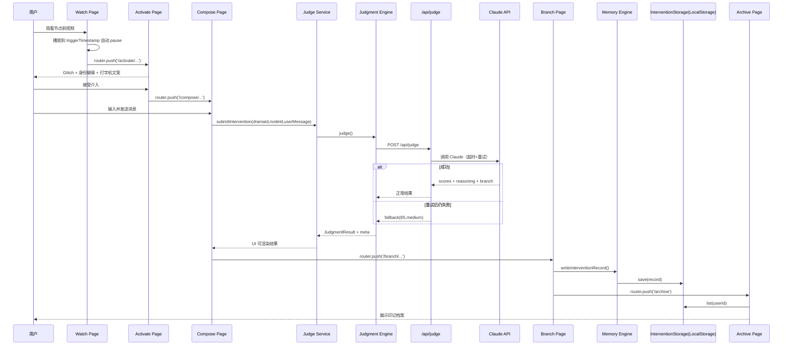

# 《入戏》工程PRD（Demo v1）

## 1. 文档目标与范围

本文档定义《入戏》Demo 的工程落地方案，服务于 2026-04-30 至 2026-05-06 的 6 天开发窗口。

- 目标形态：独立 H5（Vercel 部署）
- 目标剧目：`santi`（《三体》）
- 目标节点：`yes-button-1971`
- 必须实现：双层架构、真实 Claude 判断、抽象层接口、LocalStorage 档案、8 路由完整闭环

> 备注：`activate` 为独立路由（身份转变之门），不是 `watch` 内部状态。

---

## 2. 路由与页面边界（8 个独立路由）

1. `/`：品牌层首页
2. `/drama/santi`：剧目详情（混合层，70% 品牌 + 30% 主题）
3. `/watch/santi/yes-button-1971`：看剧与节点临近（主题层）
4. `/activate/santi/yes-button-1971`：激活仪式页（主题层）
5. `/compose/santi/yes-button-1971`：消息撰写（主题层）
6. `/judge/santi/yes-button-1971`：AI 评分（主题层）
7. `/branch/santi/yes-button-1971`：分支结果（主题层）
8. `/archive`：印记档案（品牌层）

---

## 3. 核心时序图（Mermaid）




---

## 4. 业务流程图（Mermaid）

```mermaid
flowchart TD
    A[用户进入首页] --> B[选择三体]
    B --> C[剧目详情]
    C --> D[进入 watch]
    D --> E{到达 triggerTimestamp?}
    E -- 否 --> D
    E -- 是 --> F[进入 activate 路由]
    F --> G{接受介入?}
    G -- 否 --> D
    G -- 是 --> H[compose 输入与发送]
    H --> I[services/judge-service]
    I --> J[engines/judgment]
    J --> K[/api/judge]
    K --> L{Claude 调用成功?}
    L -- 是 --> M[返回真实评分]
    L -- 否 --> N[自动重试 1 次]
    N --> O{重试成功?}
    O -- 是 --> M
    O -- 否 --> P[返回 fallback=65,medium]
    M --> Q[judge 页面可视化]
    P --> Q
    Q --> R[branch 播放分支结果]
    R --> S[memory engine 持久化]
    S --> T[archive 展示印记]
```


---

## 5. 工程分层与依赖规则

### 5.1 分层定义

- `engines/*`：核心 AI/规则能力层（纯逻辑）
  - `understanding.ts`
  - `judgment.ts`
  - `generation.ts`
  - `memory.ts`
  - `orchestrator.ts`
- `services/*`：业务编排层（组合 engines，给 UI 友好接口）
  - `intervention-service.ts`
  - `archive-service.ts`
- `app/*`（页面层）：仅处理渲染、交互、路由

### 5.2 强约束

- UI 只调用 `services/*`
- UI 不直接调用 `engines/*`
- UI 不直接调用 LLM SDK / LocalStorage
- `engines/*` 不感知 React / 路由

---

## 6. 数据模型（TypeScript Interface）

```ts
export type ThemeId = "brand" | "santi" | "long-xiang-si" | "qing-yu-nian" | "fanhua";
export type BranchType = "high" | "medium" | "low";
export type KnowledgeCheck = "verified" | "has-ooc-risk";

export interface DramaMeta {
  id: string;
  name: string;
  containerName: string;
  themeId: ThemeId;
  status: "active" | "coming-soon";
}

export interface DramaIdentity {
  id: string;
  dramaId: string;
  name: string;
  description: string;
  isAvailable: boolean; // Demo: 仅 listener-1379 为 true
  comingSoonLabel?: string; // "敬请期待"
}

export interface InterventionNode {
  id: string; // yes-button-1971
  dramaId: string; // santi
  title: string;
  episodeNumber: number; // 强制字段
  triggerTimestamp: number; // 秒, 强制字段
  triggerTimecode: string; // mm:ss, 强制字段
  videoMappingKey: string; // 对应 src/data/video-mapping.ts
  identityId: string; // listener-1379
  promptKey: string; // santi:yes-button-1971
  branchVideoKeys: {
    high: string;
    medium: string;
    low: string;
  };
}

export interface ScoreBreakdown {
  completeness: number; // 0-30
  emotion: number; // 0-30
  motivation: number; // 0-25
  consistency: number; // 0-15
}

export interface JudgmentResult {
  scores: ScoreBreakdown;
  total: number; // 0-100
  branch: BranchType;
  reasoning: string;
  knowledgeSourceCheck?: KnowledgeCheck; // 主流程不显式展示
  isFallback: boolean;
  fallbackReason?: string;
  durationMs: number;
}

export interface JudgeRequest {
  dramaId: string;
  nodeId: string;
  userMessage: string;
}

export interface UserSessionProfile {
  userId: string;
  isAuthenticated: boolean;
  displayName?: string;
}

export interface UserInterventionRecord {
  id: string;
  userId: string;
  dramaId: string;
  nodeId: string;
  identityId: string;
  userMessage: string;
  judgment: JudgmentResult;
  endingText: string;
  createdAt: number;
}

export interface CharacterDossier {
  id: string;
  dramaId: string;
  name: string;
  coreValues: string[];
  speechStyle: string;
  facts: string[]; // Demo: YES 节点最小事实集
}

export interface AiredEvent {
  id: string;
  episode: number;
  timecode: string;
  description: string;
}

export interface AiredEventsManifest {
  dramaId: string;
  nodeId: string;
  upToEpisode: number;
  upToTimestamp: number;
  events: AiredEvent[];
}
```

---

## 7. 抽象层接口（未来腾讯视频接入预留）

```ts
export interface VideoSource {
  load(videoKey: string): Promise<void>;
  play(): Promise<void>;
  pause(): void;
  seek(seconds: number): void;
  getCurrentTime(): number;
  onTimeUpdate(callback: (seconds: number) => void): () => void;
}

export interface UserSession {
  getUserId(): string;
  isAuthenticated(): boolean;
  getProfile(): Promise<UserSessionProfile | null>;
}

export interface InterventionStorage {
  save(record: UserInterventionRecord): Promise<void>;
  list(userId: string): Promise<UserInterventionRecord[]>;
  upsertLatestByNode(record: UserInterventionRecord): Promise<void>;
  clear?(userId: string): Promise<void>;
}
```

---

## 8. API 接口列表

### 8.1 `POST /api/judge`

- 功能：对用户消息做 AI 判断并返回评分结果
- 认证：无（Demo）

请求体：

```json
{
  "dramaId": "santi",
  "nodeId": "yes-button-1971",
  "userMessage": "..."
}
```

成功响应：

```json
{
  "scores": { "completeness": 24, "emotion": 20, "motivation": 14, "consistency": 10 },
  "total": 68,
  "branch": "medium",
  "reasoning": "...",
  "knowledgeSourceCheck": "verified",
  "isFallback": false,
  "durationMs": 2380
}
```

兜底响应（重试后失败）：

```json
{
  "scores": { "completeness": 20, "emotion": 18, "motivation": 17, "consistency": 10 },
  "total": 65,
  "branch": "medium",
  "reasoning": "由于网络原因,本次使用兜底评分。",
  "knowledgeSourceCheck": "verified",
  "isFallback": true,
  "fallbackReason": "NETWORK_OR_MODEL_ERROR",
  "durationMs": 30000
}
```

---

## 9. AI 调用与错误策略

`lib/claude.ts` 统一封装：

- 超时：30s
- 自动重试：1 次（后台日志记录）
- 输出校验：JSON 结构校验（字段/范围）
- 重试失败：返回 fallback（`total=65, branch=medium`）
- UI 透明提示：评分页小字“由于网络原因,本次使用兜底评分”
- 可选：`重新评分`按钮（用户主动触发）

---

## 10. 关键页面状态机

### 10.1 Watch 页面

- `idle` -> `playing` -> `near-node` -> `paused-at-node` -> `navigating-activate`
- 事件：
  - `VIDEO_TIME_REACHED_TRIGGER`
  - `GO_ACTIVATE`

### 10.2 Activate 页面

- `intro-glitch` -> `identity-reveal` -> `task-reveal` -> `decision`
- 事件：
  - `ACCEPT_INTERVENTION` -> `/compose/...`
  - `KEEP_WATCHING` -> `router.back()` 到 `/watch/...`

### 10.3 Compose 页面

- `editing` -> `valid` -> `submitting` -> `submitted`
- 约束：
  - 字数 `20-300`
  - 一次发送（提交后禁用）

### 10.4 Judge 页面

- `loading` -> `rendering-score` -> `ready-for-branch`
- 分支：
  - `normal-result`
  - `fallback-result`（显示兜底提示）

### 10.5 Branch 页面

- `playing-branch-video` -> `ending-text` -> `persisting-record` -> `to-archive`

### 10.6 Archive 页面

- `loading-records` -> `show-list` -> `filtering`

---

## 11. 双层视觉架构落地约束

- 品牌层代码：`components/brand/*`、`styles/brand.css`
- 主题层代码：`components/theme/santi/*`、`themes/santi/theme.css`
- 混合层页面：`/drama/santi`、`/judge/...`（骨架品牌 + 皮肤主题）
- 路由切换触发主题切换：
  - 进入剧中：`brand -> santi`
  - 退出档案：`santi -> brand`

---

## 12. Story Grounding（基础版）

仅覆盖 YES 节点的最小可信事实集：

- `themes/santi/knowledge/characters/ye-wenjie.ts`
- `themes/santi/knowledge/characters/listener-1379.ts`
- `themes/santi/knowledge/aired-events-before-yes.ts`

约束：

- Prompt 只可引用该节点前剧版事件
- 主流程 UI 不展示 OOC 标记
- Debug 抽屉与档案页可查看 `knowledgeSourceCheck`

---

## 13. P0 / P1 / P2 工程范围

### 🔴 P0（必做）

- 单剧单节点 8 路由闭环
- 双层架构代码与转场
- 真实 Claude judge + fallback 策略
- LocalStorage 印记档案
- Vercel 部署与可录屏演示链路

### 🟡 P1（必做但可降级）

- 其他剧主题层 wireframe（静态展示）
- 多身份展示（3 卡片，仅 1379 可用）
- 抽象层接口完整落地（Demo 实现）
- Story Grounding 基础版（仅 YES 节点）

### ⏸️ P2（backlog）

- 多剧真实运行
- 多身份真实可点击
- 多节点真实编排
- 实时视频生成
- 跨用户社交能力
- 移动端深度优化

---

## 14. 验收门槛（工程）

- 能从 `/` 无阻塞跑到 `/archive`
- judge 接口成功与失败两种路径均可完成闭环
- fallback 路径不会卡死流程
- 1379 可完整体验；另外 2 身份卡有灰态与“敬请期待”
- 更换 `video-mapping` 后不改页面逻辑

